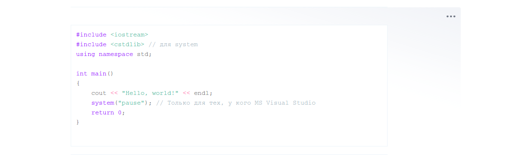

# CodeHighlight with Select code and highlight for Editor.js


Code Highlight for the [Editor.js](https://ifmo.su/editor) allows to include code examples in your articles.

Use this tool so simple, just select code


And write code


## Installation

### Download to your project's source dir

1. Upload folder `dist` from repository
2. Add `dist/bundle.js` file to your page.

## Usage

Add a new Tool to the `tools` property of the Editor.js initial config.

```javascript
var editor = EditorJS({
  ...
  
  tools: {
    ...
    code: CodeTool,
  }
  
  ...
});
```

## Output data

This Tool returns code.

```json
{
    "type" : "code",
    "data" : {
        "code": "body {\n font-size: 14px;\n line-height: 16px;\n}",
        "language": "css"
    }
}
```

